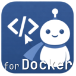
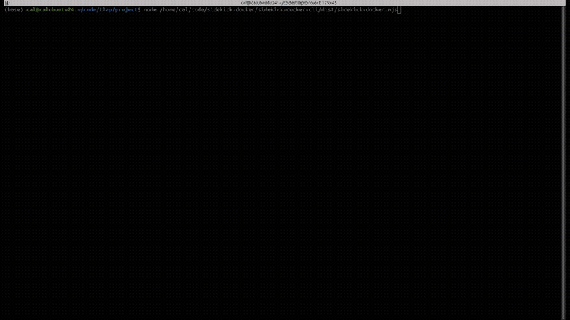
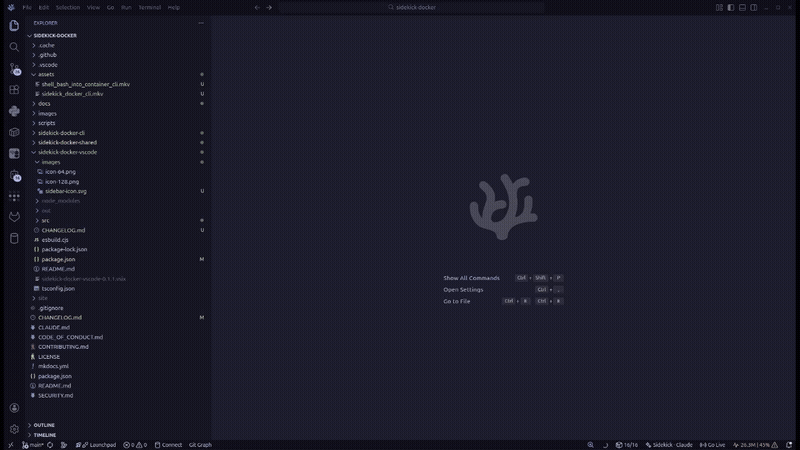

<p align="center">
  
</p>

<h1 align="center">Sidekick Docker</h1>

<p align="center">
  <a href="https://open-vsx.org/extension/CesarAndresLopez/sidekick-docker-vscode"></a>
  <a href="https://open-vsx.org/extension/CesarAndresLopez/sidekick-docker-vscode"></a>
  <a href="https://marketplace.visualstudio.com/items?itemName=CesarAndresLopez.sidekick-docker-vscode"></a>
  <a href="https://marketplace.visualstudio.com/items?itemName=CesarAndresLopez.sidekick-docker-vscode"></a>
  <a href="https://www.npmjs.com/package/sidekick-docker"></a>
  <a href="https://www.npmjs.com/package/sidekick-docker"></a>
  <a href="LICENSE"></a>
  <a href="https://github.com/cesarandreslopez/sidekick-docker/actions/workflows/ci.yml"></a>
  <a href="https://deepwiki.com/cesarandreslopez/sidekick-docker"></a>
</p>

<p align="center">
  <strong>Your Docker dashboard, everywhere.</strong> A full-featured Docker management dashboard that runs in your terminal and in VS Code.
</p>

<p align="center">
  
</p>

<p align="center">
  
</p>

## What is this?

Sidekick Docker gives you a real-time, keyboard-driven dashboard for managing your entire Docker environment — containers, Compose projects, images, volumes, and networks. Run it as a standalone TUI in any terminal, or open it as a panel inside VS Code. Same power, two surfaces.

## Features

- **Real-time streaming** — logs, stats, and Docker events update live as they happen
- **Smart log highlighting** — token-level syntax coloring for HTTP methods, status codes, URLs, IPs, timestamps, JSON keys, and more
- **Log search & filter** — search within log output with exact or fuzzy matching and match highlighting
- **Log analytics** — severity counts, severity sparkline over time, and pattern clustering that groups similar logs into templates
- **Dual-log compare** — pin a second container or service to compare log streams side by side
- **Vi keybindings** — navigate with `j`/`k`, jump with `g`/`G`, switch panels with `1`-`5`, page with `PgUp`/`PgDn` or `Ctrl+D`/`Ctrl+U`
- **Sparkline charts** — CPU, memory, network I/O, block I/O, and log severity rendered as inline sparklines
- **Filesystem inspector** — view all filesystem changes inside containers (added/changed/deleted files)
- **Image layer explorer** — inspect image layer history with sizes and Dockerfile instructions
- **Compose support** — detect projects from container labels, show running/total replicas, and preserve recorded override files for lifecycle actions
- **Interactive exec** — drop into a running container shell without leaving the dashboard
- **Filter & search** — `/` to filter any resource list by name
- **Confirmation modals** — destructive actions (remove, prune) always ask first
- **Mouse support** — click to select, scroll to navigate, right-click for the actions menu
- **Scriptable CLI** — `ps`, `logs`, `images`, `volumes`, `networks`, `stats`, `df` and `inspect`, each with `--format json` and `-q` where it makes sense, for scripts and pipes, with `--no-color`/`NO_COLOR` support
- **Disk usage** — `df` reports images, containers, volumes and build cache, the last of which is usually the biggest surprise
- **Prune everything** — reclaim space from stopped containers, dangling images, unused volumes and networks, with the reclaimed total reported back
- **Flexible endpoints** — `--socket` accepts a socket path, `unix://` URL, or `tcp://host:port` for remote daemons
- **SSH connections** — connect with `DOCKER_HOST=ssh://user@host`; the CLI and extension include the SSH transport
- **Refresh recovery** — keep the last successful resource data when part of a refresh fails; the VS Code dashboard also offers Retry controls for detail loads and streams
- **VS Code extension** — the same dashboard, embedded as a webview panel

## Quick Start

### Terminal (TUI)

```bash
npm install -g sidekick-docker
sidekick-docker
```

### VS Code / VSCodium / Compatible Editors

Install the **Sidekick Docker** extension from [Open VSX](https://open-vsx.org/extension/CesarAndresLopez/sidekick-docker-vscode) or the [VS Code Marketplace](https://marketplace.visualstudio.com/items?itemName=CesarAndresLopez.sidekick-docker-vscode), then run `Sidekick Docker: Open Dashboard` from the command palette (or press `Ctrl+Alt+D`).

## Packages

| Package | Description |
|---------|-------------|
| [`sidekick-docker-cli`](sidekick-docker-cli/) | TUI dashboard and CLI commands (Ink + React) |
| [`sidekick-docker-shared`](sidekick-docker-shared/) | Docker API abstraction layer, types, Compose detection |
| [`sidekick-docker-vscode`](sidekick-docker-vscode/) | VS Code extension with embedded dashboard webview |

## Build from Source

```bash
git clone https://github.com/cesarandreslopez/sidekick-docker.git
cd sidekick-docker
bash scripts/build-all.sh
node ./sidekick-docker-cli/dist/sidekick-docker.mjs
```

Requires **Node.js >= 22.12** and **Docker** running.

## Documentation

Full documentation is available at the [docs site](https://cesarandreslopez.github.io/sidekick-docker/), including:

- [Getting Started](https://cesarandreslopez.github.io/sidekick-docker/getting-started/installation/)
- [TUI Dashboard](https://cesarandreslopez.github.io/sidekick-docker/features/dashboard/)
- [CLI Commands](https://cesarandreslopez.github.io/sidekick-docker/features/cli-commands/)
- [VS Code Extension](https://cesarandreslopez.github.io/sidekick-docker/features/vscode/)
- [Architecture](https://cesarandreslopez.github.io/sidekick-docker/architecture/overview/)

## See Also

**[Sidekick Agent Hub](https://github.com/cesarandreslopez/sidekick-agent-hub)** — Multi-provider AI coding agent monitor. Real-time visibility into Claude Code, OpenCode, and Codex CLI sessions with token tracking, context management, and session intelligence. Available as a [TUI on npm](https://www.npmjs.com/package/sidekick-agent-hub) and as a VS Code extension on the [Marketplace](https://marketplace.visualstudio.com/items?itemName=CesarAndresLopez.sidekick-for-max) and [Open VSX](https://open-vsx.org/extension/cesarandreslopez/sidekick-for-max).

## Contributing

Contributions are welcome! See [CONTRIBUTING.md](CONTRIBUTING.md) for setup instructions and guidelines.

## License

[MIT](LICENSE)
