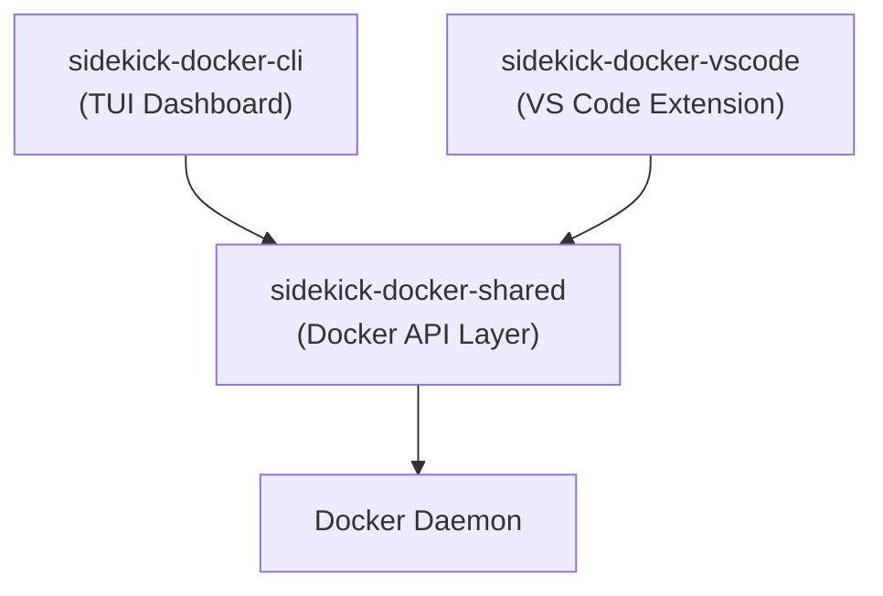
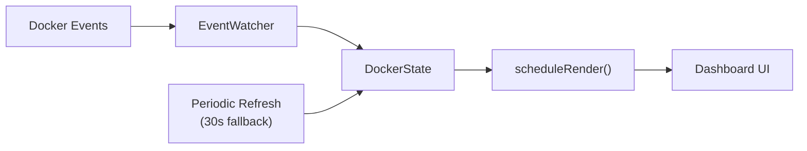

# Architecture Overview

Sidekick Docker is a monorepo with three packages that share a common Docker API layer.

## Package Structure



| Package | Build Tool | Output | Module Format |
|---------|-----------|--------|---------------|
| `sidekick-docker-shared` | tsc | `dist/` | CommonJS + declarations (Docker API + log analytics) |
| `sidekick-docker-cli` | esbuild | `dist/sidekick-docker.mjs` | ESM (single file) |
| `sidekick-docker-vscode` | esbuild | `out/extension.js` + `out/webview/dashboard.js` | CJS (extension) + IIFE (webview) |

## Data Flow



1. **Docker events** stream from the daemon via `EventWatcher`
2. Events are processed by `DockerState.processEvent()`, which updates the in-memory resource lists
3. `scheduleRender()` triggers a React re-render of the affected panel
4. A 30-second periodic refresh provides a fallback in case events are missed

## Build System

The shared library must be built first — both CLI and VS Code packages depend on it via a local file path (`file:../sidekick-docker-shared`).

```bash
# Full build order
npm run build:shared   # tsc
npm run build:cli      # esbuild
npm run build:vscode   # esbuild
```

### esbuild Plugins (CLI)

The CLI build uses custom esbuild plugins to handle Node.js-specific modules:

- **Stubs**: `ssh2`, `cpu-features`, `react-devtools-core` (not needed at runtime)
- **Externals**: `node-pty` (native module, must be installed separately)
- **Defines**: `__CLI_VERSION__` injected from `package.json`

### esbuild Output (VS Code)

The VS Code extension produces two bundles:

- `out/extension.js` — CJS, runs in the Node.js extension host
- `out/webview/dashboard.js` — IIFE, runs in the browser webview context
- **Defines**: `__VERSION__` injected from `package.json` (used for status bar display)

The webview source is modular — `dashboard.ts` orchestrates rendering, with keyboard handling (`keyboard.ts`), overlays (`overlays.ts`), and per-resource renderers (`panels/`) in separate modules — all bundled into the single IIFE file above.

## Dashboard Decomposition

The main `Dashboard` component delegates input handling to extracted modules:

- **`keyRegistry.ts`** — declarative registry of global keybindings; the single source of truth that drives dispatch, the help overlay, and status-bar hints
- **`useKeyboardHandler`** — keyboard input router with a fixed dispatch order: exec passthrough → Ctrl+C → active overlay handler → global bindings from the key registry → per-panel action shortcuts
- **`useMouseHandler`** — mouse click, scroll, and right-click handling, including clickable overlays
- **`Dashboard.tsx`** — state management (`useReducer`) and render orchestration
