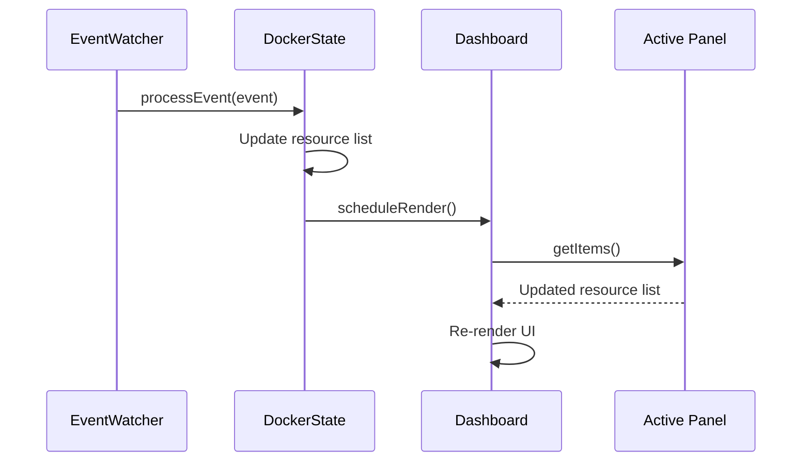

# Panel System

Every resource type in the dashboard is implemented as a panel that conforms to the `SidePanel` interface.

## SidePanel Interface

Each panel implements:

| Method | Purpose |
|--------|---------|
| `getItems()` | Returns the list of resources to display in the side list |
| `detailTabs[]` | Array of tab definitions, each with a render function |
| `getActions()` | Returns per-item actions (shortcut key, confirm metadata, handler) for the actions menu |
| `getSearchableText()` | Optional per-item text used by the `/` filter |

The interface is defined in `sidekick-docker-cli/src/dashboard/panels/types.ts`. Panels do not define keybindings themselves: global keys (including panel-contextual ones like filter, sort, and compare) live in the central registry at `sidekick-docker-cli/src/dashboard/ink/keyRegistry.ts`, while per-item action shortcuts come from `getActions()`.

## Panel Implementations

All five live in `sidekick-docker-cli/src/dashboard/panels/`.

| Panel | Class | Resources |
|-------|-------|-----------|
| Containers | `ContainersPanel` | Docker containers |
| Services | `ServicesPanel` | Compose projects and services |
| Images | `ImagesPanel` | Local images |
| Volumes | `VolumesPanel` | Named volumes |
| Networks | `NetworksPanel` | Docker networks |

## State Management

The main `Dashboard` component uses `useReducer` for UI state (selected panel, selected item, focus area, filter text, modal state). Input handling is delegated to `useKeyboardHandler` and `useMouseHandler` hooks, with global keybindings defined in `keyRegistry.ts`.

Domain state (the actual Docker resources) lives in the `DockerState` class, which:

1. Holds the current lists of containers, images, volumes, networks, and compose projects
2. Exposes methods to refresh individual resource types
3. Processes Docker events to update resources incrementally
4. Calls `scheduleRender()` to notify the UI of changes

## Rendering Flow

