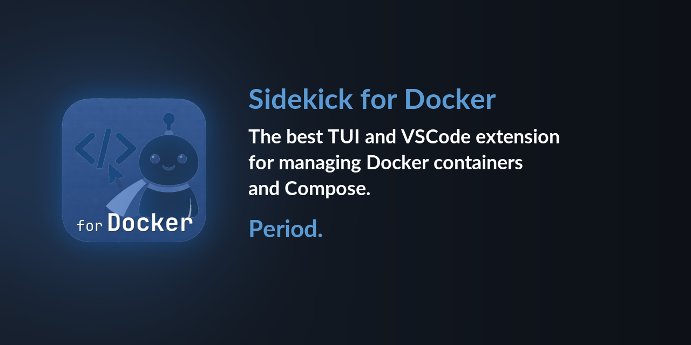

# Sidekick Docker

<p align="center">
  
</p>

<p align="center">
  <strong>Your Docker dashboard, everywhere.</strong>
</p>

<p align="center">
  <a href="https://open-vsx.org/extension/CesarAndresLopez/sidekick-docker-vscode"></a>
  <a href="https://marketplace.visualstudio.com/items?itemName=CesarAndresLopez.sidekick-docker-vscode"></a>
  <a href="https://www.npmjs.com/package/sidekick-docker"></a>
  <a href="https://github.com/cesarandreslopez/sidekick-docker/blob/main/LICENSE"></a>
  <a href="https://github.com/cesarandreslopez/sidekick-docker/actions/workflows/ci.yml"></a>
</p>

---

A full-featured Docker management dashboard that runs in your terminal and in VS Code. Manage containers, Compose projects, images, volumes, and networks from a real-time, keyboard-driven interface.

<p align="center">
  
</p>

## Feature Highlights

- **Five-panel dashboard** — Containers, Compose Services, Images, Volumes, Networks
- **Real-time streaming** — logs, stats sparklines, and Docker events update live
- **Vi keybindings** — `j`/`k` navigation, `g`/`G` jump, `1`-`5` panel switching
- **Compose support** — automatic project detection, per-project actions
- **Interactive exec** — shell into running containers without leaving the dashboard
- **Filter & search** — `/` to filter any resource list
- **Mouse support** — click to select, scroll to navigate
- **VS Code extension** — the same dashboard, embedded as a webview panel (works in VS Code, VSCodium, and compatible editors)

## Quick Install

### Terminal (TUI)

```bash
npm install -g sidekick-docker
sidekick-docker
```

### VS Code / VSCodium / Compatible Editors

Install the **Sidekick Docker** extension from [Open VSX](https://open-vsx.org/extension/CesarAndresLopez/sidekick-docker-vscode) or the [VS Code Marketplace](https://marketplace.visualstudio.com/items?itemName=CesarAndresLopez.sidekick-docker-vscode), then run `Sidekick Docker: Open Dashboard` from the command palette.

## See Also

**[Sidekick Agent Hub](https://github.com/cesarandreslopez/sidekick-agent-hub)** — Multi-provider AI coding agent monitor. Real-time visibility into Claude Code, OpenCode, and Codex CLI sessions with token tracking, context management, and session intelligence. Available as a [TUI on npm](https://www.npmjs.com/package/sidekick-agent-hub) and as a VS Code extension on the [Marketplace](https://marketplace.visualstudio.com/items?itemName=CesarAndresLopez.sidekick-for-max) and [Open VSX](https://open-vsx.org/extension/cesarandreslopez/sidekick-for-max).

## Next Steps

- [Installation](getting-started/installation.md) — all install methods
- [Quick Start](getting-started/quick-start.md) — first-run walkthrough
- [Keybindings](features/keybindings.md) — full keyboard reference
- [Architecture](architecture/overview.md) — how it all fits together
